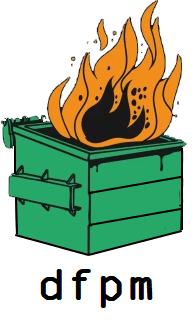

  

  A reasonable javascript package manager.

---

## Features

* **Dependency Warning.** When you add a dependency, we check the real cost and warn you before proceeding.
* **Package Recommendations.** When adding a dependency, if that package is considered unsafe or unmaintained we try to recommend reasonable alternatives.
* **Fast.** We leverage something other than javascript to write an actually performant program.
* **Hermetic builds.** dfpm is designed to produce repeatable builds despite any differences in platform, machine, etc.

## Installing dfpm

TODO

## Using dfpm

TODO

## Contributing to dfpm

Contributions are always welcome, no matter how large or small.

See [Contributing](#).
